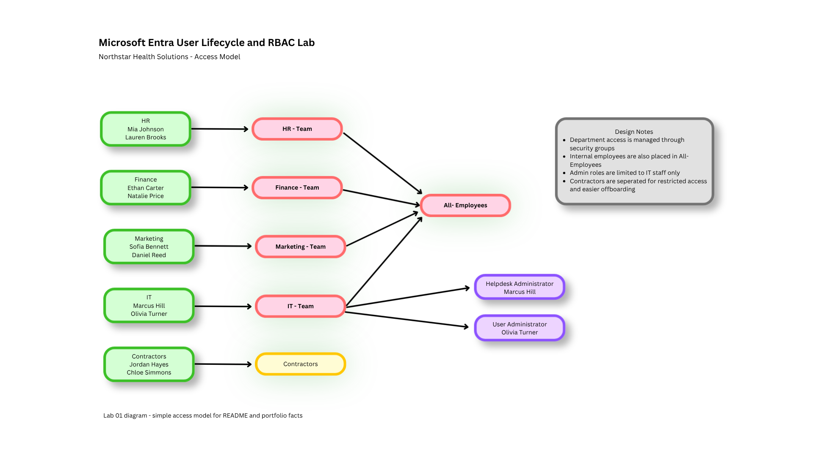

# Microsoft Entra User Lifecycle and RBAC Lab

## Overview
This lab demonstrates foundational identity and access management concepts using Microsoft Entra. The project focuses on user lifecycle management, group-based access control, scoped administrative roles, and offboarding processes in a small business environment.

The goal is to show practical understanding of how identities are created, managed, assigned access, and removed in a structured and security-minded way.

---

## Objective
Build a hands-on Microsoft Entra lab that simulates how an organization manages employee identities throughout their lifecycle, including:

- user creation
- group assignment
- role-based access control
- least-privilege administration
- offboarding and access removal

---

## Business Scenario
A fictional company, **Northstar Health Solutions**, is growing and needs a cleaner way to manage employee access.

The company has employees across multiple departments:

- Human Resources
- Finance
- Marketing
- IT
- Contractors

Previously, access was assigned manually to each person, which created inconsistency and increased the risk of overprovisioning. Leadership wants a more structured identity model where users are assigned access based on department and job function, while administrative privileges are limited to the IT team.

This lab simulates how that access model can be designed and implemented in Microsoft Entra.

---

## Skills Demonstrated
- Microsoft Entra user administration
- group-based access control
- role-based access control (RBAC)
- least-privilege design
- onboarding and offboarding workflows
- identity lifecycle management
- access documentation
- administrative role scoping

---

## Tools Used
- Microsoft Entra admin center
- Azure portal
- GitHub
- Markdown
- Draw.io / diagrams.net *(optional, for diagrams)*

---

## Environment
This lab was built in a Microsoft Entra test tenant using demo users and groups.

### Tenant Setup
- Microsoft Entra test environment
- cloud-only users
- security groups for departmental access
- scoped administrative roles for IT staff only

### Department Structure
The following departments were created for the lab:

- HR
- Finance
- Marketing
- IT
- Contractors

---

## Lab Design

### User Naming Convention
To keep the lab organized, users were named using a simple role-based convention.

Examples:
- hr.manager
- finance.analyst
- marketing.coord
- it.support1
- it.support2
- contractor1

### Group Design
The following groups were created:

- HR-Team
- Finance-Team
- Marketing-Team
- IT-Team
- Contractors
- All-Employees

### Role Design
Administrative roles were limited to IT users only.

Examples:
- User Administrator
- Helpdesk Administrator

This supports the principle of least privilege by ensuring standard department users do not receive unnecessary administrative access.

---

## Access Model
The access model in this lab is group-based.

Instead of assigning access directly to each user, users are added to department groups. This makes the environment easier to manage, easier to audit, and more scalable as the company grows.

### Example Access Logic
- HR users belong to **HR-Team**
- Finance users belong to **Finance-Team**
- Marketing users belong to **Marketing-Team**
- IT users belong to **IT-Team**
- Contractors belong to **Contractors**
- All internal staff belong to **All-Employees**

---

## Implementation Steps

### Step 1: Created Department Users
Created test users representing employees across each department.

Example users:
- hr.manager
- hr.generalist
- finance.analyst
- finance.manager
- marketing.coord
- marketing.specialist
- it.support1
- it.support2
- contractor1
- contractor2

### Step 2: Created Security Groups
Created security groups to reflect department-based access.

Groups created:
- HR-Team
- Finance-Team
- Marketing-Team
- IT-Team
- Contractors
- All-Employees

### Step 3: Assigned Users to Groups
Added each user to the appropriate department group.

Examples:
- `finance.analyst` → Finance-Team, All-Employees
- `it.support1` → IT-Team, All-Employees
- `contractor1` → Contractors

### Step 4: Assigned Administrative Roles
Assigned scoped admin roles only to designated IT users.

Examples:
- `it.support1` → Helpdesk Administrator
- `it.support2` → User Administrator

No administrative roles were assigned to HR, Finance, Marketing, or Contractors.

### Step 5: Simulated Onboarding
Simulated a new employee joining the Finance department.

Actions performed:
- created new user account
- assigned account to Finance-Team
- assigned account to All-Employees
- confirmed that no admin roles were applied

### Step 6: Simulated Offboarding
Simulated a contractor leaving the organization.

Actions performed:
- disabled user account
- removed user from Contractors group
- documented access removal steps

---

## Testing and Validation

### Test Case 1: New Finance Employee Onboarding
**Expected Result:**  
A new finance employee should be added to the correct department group without receiving unnecessary admin privileges.

**Actual Result:**  
The user was successfully created and assigned to Finance-Team and All-Employees. No admin roles were assigned.

**Status:**  
Pass

---

### Test Case 2: IT User Role Assignment
**Expected Result:**  
An IT support user should receive an appropriate scoped administrative role.

**Actual Result:**  
The IT support account was successfully assigned a limited admin role.

**Status:**  
Pass

---

### Test Case 3: Contractor Offboarding
**Expected Result:**  
A departing contractor should lose group-based access and have the account disabled.

**Actual Result:**  
The contractor account was disabled and removed from the Contractors group.

**Status:**  
Pass

---

## Security Considerations
This lab was designed around several core IAM and security principles.

### Least Privilege
Standard users were not assigned administrative roles. Only designated IT users received limited admin access.

### Group-Based Access
Departmental access was managed through groups instead of direct user-by-user assignment. This reduces human error and simplifies access reviews.

### Separation of Duties
Administrative roles were separated from normal employee access to reduce the risk of privilege creep.

### Offboarding as a Security Control
Removing access for departing users is a critical identity security function, not just an HR process.

### Access Model Diagram

---

