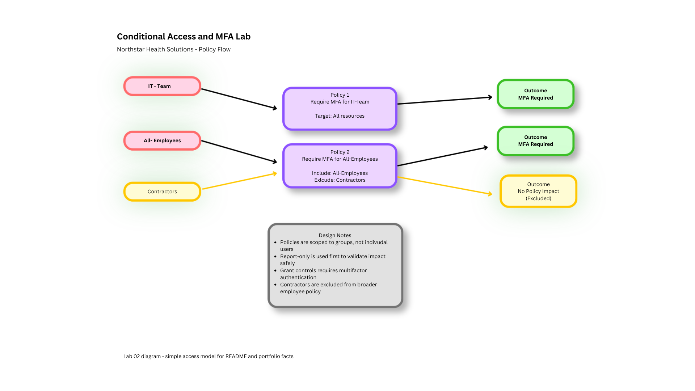

# Microsoft Entra Conditional Access and MFA Lab

## Overview
This lab demonstrates foundational Conditional Access and MFA concepts in Microsoft Entra. The project focuses on creating and documenting access policies that help protect user identities, especially privileged accounts, by applying additional sign-in controls.

The goal of this lab is to show practical understanding of how Conditional Access policies are scoped, how MFA is enforced, how exclusions are handled, and how policy outcomes are validated.

---

## Objective
Build a hands-on Microsoft Entra lab that simulates how an organization protects identities using Conditional Access and MFA.

This lab includes:
- policy design
- MFA enforcement
- policy scoping
- exclusions
- testing and validation
- documentation of security reasoning

---

## Business Scenario
A fictional company, **Northstar Health Solutions**, wants to improve identity security after recognizing that user accounts and administrative accounts need stronger sign-in protection.

Leadership wants to reduce the risk of unauthorized access by requiring MFA for high-risk user populations, especially IT staff with elevated responsibilities. The company also wants a simple, repeatable way to document policy scope, expected outcomes, and exceptions.

This lab simulates how Conditional Access policies can be designed and implemented in Microsoft Entra to support that goal.

---

## Skills Demonstrated
- Microsoft Entra Conditional Access configuration
- MFA policy enforcement
- policy scoping and assignments
- identity protection concepts
- least-privilege thinking
- policy testing and validation
- exception handling
- access documentation

---

## Tools Used
- Microsoft Entra admin center
- Azure portal
- GitHub
- Markdown
- Draw.io / diagrams.net *(optional, for diagrams)*

---

## Environment
This lab was built in a Microsoft Entra test tenant using demo users and groups created in Lab 1.

### Groups Used
- IT-Team
- All-Employees
- Contractors

### Key Users Used for Testing
- Marcus Hill
- Olivia Turner
- Mia Johnson
- Jordan Hayes

---

## Lab Design

### Policy Approach
This lab uses Conditional Access to apply MFA requirements to selected users and groups.

The policy design focused on:
- protecting privileged or sensitive accounts first
- documenting who is included and excluded
- validating policy behavior through test scenarios
- keeping the rollout simple and understandable

### Policies Created
1. **Require MFA for IT-Team**
2. **Require MFA for All-Employees** *(or another scoped user set, depending on tenant setup)*

### Exclusion Logic
Where appropriate, contractor or alternate test accounts were excluded to demonstrate policy scoping and exception handling.

---

## Implementation Steps

### Step 1: Reviewed Existing Users and Groups
Used the existing lab environment from Lab 1, including IT-Team, All-Employees, and Contractors.

### Step 2: Created Conditional Access Policy for IT-Team
Built a policy requiring MFA for members of the IT-Team group.

Key configuration areas included:
- target users/group
- included cloud apps or resources
- MFA access control
- enabled policy state

### Step 3: Created a Broader MFA Policy
Built a second Conditional Access policy for a broader user population, such as All-Employees.

This demonstrated how MFA can be applied beyond admins while still maintaining clear policy scope.

### Step 4: Documented Policy Scope and Exclusions
Documented which groups were included and which users or groups were excluded for testing or business continuity purposes.

### Step 5: Tested Policy Behavior
Tested expected outcomes for:
- an IT user
- a standard employee
- an excluded or non-targeted user

### Step 6: Recorded Validation Results
Captured screenshots and test results to confirm that policy logic aligned with expected outcomes.

---

## Testing and Validation

### Test Case 1: IT User Sign-In
**Expected Result:**  
An IT-Team user should be required to complete MFA.

**Actual Result:**  
The targeted IT user was prompted for MFA based on policy scope.

**Status:**  
Pass

---

### Test Case 2: Standard Employee Sign-In
**Expected Result:**  
A standard employee in the targeted policy scope should also be required to complete MFA.

**Actual Result:**  
The selected employee was prompted for MFA based on the broader user policy.

**Status:**  
Pass

---

### Test Case 3: Excluded or Non-Targeted User
**Expected Result:**  
An excluded or out-of-scope user should not be affected by the tested policy.

**Actual Result:**  
The selected user was not impacted by the Conditional Access policy.

**Status:**  
Pass

---

## Security Considerations

### Protecting Privileged Accounts
Administrative or IT-aligned users should have stronger sign-in protections because they are higher-value targets.

### MFA as a Baseline Control
MFA helps reduce the risk of unauthorized access caused by weak, stolen, or reused passwords.

### Clear Scope Matters
Conditional Access policies should be documented carefully to avoid misconfigurations or unintended access issues.

### Exclusions Should Be Limited
Exceptions should be used sparingly and clearly documented so they do not weaken the control unnecessarily.

### Conditional Access Policy Flow

---

