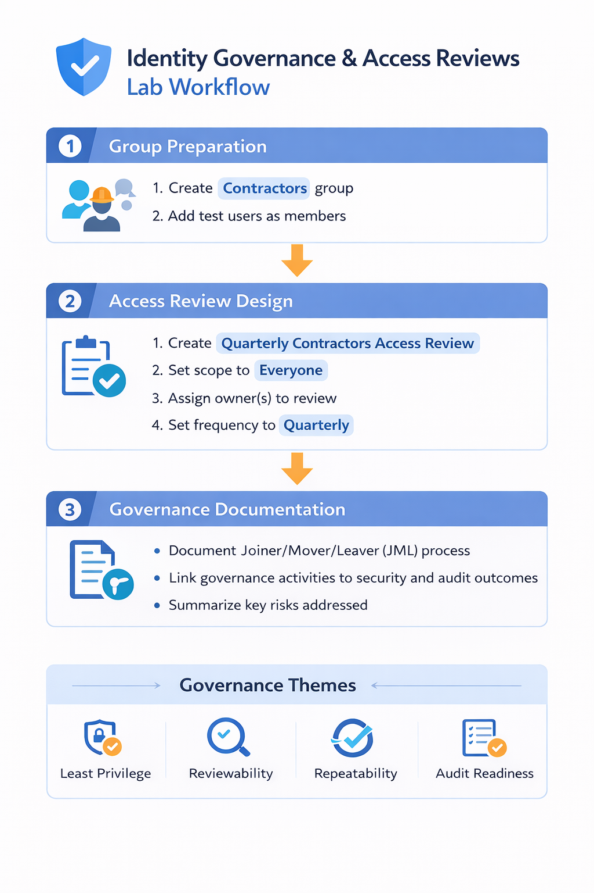

# Identity Governance, Access Reviews, and JML Lab

## Overview
This lab demonstrates foundational identity governance concepts in Microsoft Entra, with a focus on access reviews, group-based access control, and Joiner-Mover-Leaver (JML) process design.

The goal of this project is to show practical understanding of how organizations govern identity lifecycle events, review access on a recurring basis, reduce excessive permissions, and document repeatable access control processes in a Microsoft identity environment.

---

## Objective
Build a hands-on Microsoft Entra governance lab that simulates how an organization manages identity lifecycle and access validation through group-based assignments, access reviews, and documented JML workflows.

This lab includes:
- group-based access structure
- user-to-group assignment review
- access review design
- JML workflow documentation
- governance control mapping

---

## Business Scenario
A fictional company, **Northstar Health Solutions**, wants to strengthen identity governance for internal users and governed access groups.

Leadership wants the IT and security team to reduce standing access risk, formalize access decisions, and improve audit readiness by using group-based assignment, recurring access reviews, and a documented Joiner-Mover-Leaver process.

This lab simulates how that governance structure can be designed and documented in a Microsoft Entra environment.

---

## Skills Demonstrated
- identity governance concepts
- Microsoft Entra administration
- access review design
- group-based access control
- identity lifecycle planning
- Joiner-Mover-Leaver process documentation
- governance and audit readiness thinking
- least privilege and access recertification concepts

---

## Tools Used
- Microsoft Entra admin center
- Microsoft Intune admin center *(optional context only)*
- Microsoft Entra groups / security groups
- GitHub
- Markdown
- Draw.io / diagrams.net *(optional, for diagrams)*

---

## Environment
This lab was built in a Microsoft Entra test environment using users and groups created in earlier identity labs.

### Groups Used
- All-Employees
- IT-Team
- Contractors

### Governance Scope
- one governed access group
- one or more internal users assigned through that group
- one recurring access review use case
- documented JML process for onboarding, role changes, and offboarding

---

## Lab Design

### Governance Approach
This lab uses three main identity governance concepts:

1. **Group-based access control**  
   Used to assign organizational access through groups instead of direct user-by-user assignment.

2. **Access reviews**  
   Used to validate whether users still need assigned group membership and to support periodic recertification.

3. **JML workflow design**  
   Used to document how access should be granted, changed, and removed across the user lifecycle.

### Key Design Goals
- assign access through groups instead of direct user assignment
- simulate periodic access validation through an access review model
- document a repeatable JML process
- show how governance supports least privilege and audit readiness
- keep the setup simple and realistic for a small managed environment

---

## Implementation Steps

### Step 1: Identified Governance Scope
Selected the **Contractors** group as the primary governance target for the lab.

### Step 2: Reviewed Group-Based Access Structure
Confirmed that the Contractors group contained active members and could serve as a realistic access review use case.

### Step 3: Selected Access Review Use Case
Chose a practical review scenario by reviewing membership in the **Contractors** group.

### Step 4: Designed Access Review Settings
Configured an access review model that defined:
- review target = Contractors group
- reviewers = group owners
- review frequency = quarterly
- duration = 3 days
- no end date
- justification required
- reminders and email notifications enabled

### Step 5: Reviewed Access Review Results
Captured the review overview, settings, and results/status views in Microsoft Entra to document the governance workflow.

### Step 6: Documented JML Workflow
Created a basic Joiner-Mover-Leaver process to show how access should be:
- granted for new hires
- updated during department or role changes
- removed during offboarding

### Step 7: Mapped Governance Controls
Documented how group assignment, access reviews, and JML workflows support governance goals such as least privilege, reviewability, repeatability, and audit evidence.

---

## Testing and Validation

### Test Case 1: Group-Based Access Structure
**Expected Result:**  
Users should be assigned through a governance-relevant group rather than unmanaged one-off access.

**Actual Result:**  
The Contractors group contained assigned users and served as the access boundary for the lab.

**Status:**  
Pass

---

### Test Case 2: Access Review Design
**Expected Result:**  
A recurring access review should exist for a meaningful group scope.

**Actual Result:**  
A quarterly access review was created for the Contractors group with owner review, justification, reminders, and review settings configured.

**Status:**  
Pass

---

### Test Case 3: Governance Documentation
**Expected Result:**  
A documented lifecycle process should exist for onboarding, role change, and offboarding events.

**Actual Result:**  
A Joiner-Mover-Leaver workflow was documented for repeatable identity governance operations.

**Status:**  
Pass

---

### Test Case 4: Governance Control Mapping
**Expected Result:**  
The lab should connect identity actions to governance outcomes such as least privilege and audit readiness.

**Actual Result:**  
Control mapping was documented to show how access reviews, group structure, and lifecycle processes reduce risk.

**Status:**  
Pass

---

## Screenshots and Evidence

### 01-group-overview.png
Shows the **Contractors** group used as the primary governance target for the lab.

### 02-user-assignment.png
Shows sample user membership inside the **Contractors** group.

### 03-access-review-overview.png
Shows the created access review for the Contractors group.

### 04-access-review-settings.png
Shows the access review configuration, including reviewers, scope, recurrence, and completion behavior.

### 05-access-review-results.png
Shows the review results or current review status/details.

---

## Security Considerations

### Access Should Be Revalidated
Just because access was appropriate once does not mean it should remain indefinitely.

### Groups Improve Governance
Group-based assignment is easier to review, remove, and audit than direct user-by-user access assignment.

### Identity Lifecycle Matters
Good identity governance includes more than login controls. It also includes how access is granted, changed, reviewed, and removed.

### Reviews Support Least Privilege
Access reviews reduce stale permissions and help organizations confirm that users still need what they have.

### Governance Supports Audit Readiness
Well-documented access decisions and lifecycle workflows create stronger evidence for internal controls and compliance reviews.

## Artifacts

- [Access Review Summary](artifacts/access-review-summary.md)
- [Joiner-Mover-Leaver (JML) Process Design](artifacts/jml-process-design.md)
- [Governance Control Mapping](artifacts/governance-control-mapping.md)

## Identity Governance Flow Diagram

---