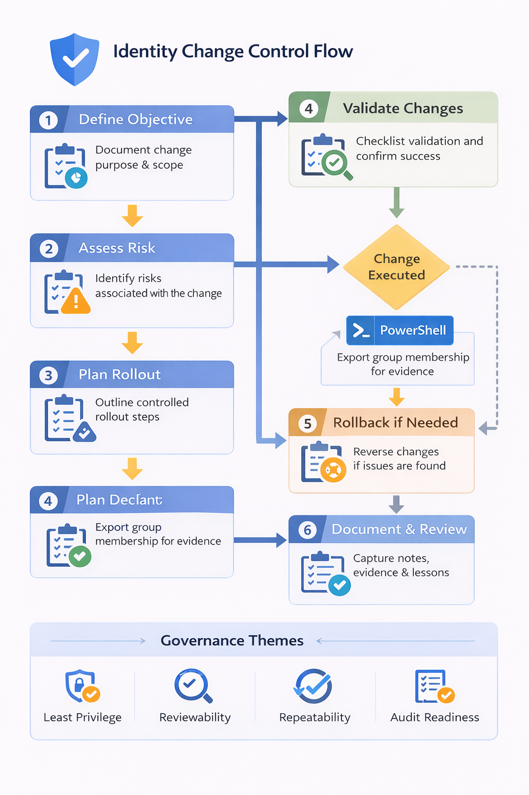

# Identity Governance Change Request + PowerShell Documentation Lab

## Overview
This lab demonstrates a governance-focused change management scenario related to identity and access administration.

The goal of this project is to show practical understanding of how organizations document, review, and validate identity-related changes in a controlled way, including change objective, risk, rollout planning, rollback planning, validation, operational notes, and a small supporting PowerShell script.

---

## Objective
Build a mini identity governance change project that simulates a controlled access-related change in a Microsoft identity environment.

This lab includes:
- a change request objective
- risk assessment
- rollout plan
- rollback plan
- validation checklist
- operational notes
- a small PowerShell support script

---

## Business Scenario
A fictional company, **Northstar Health Solutions**, wants to strengthen governance around contractor access.

The IT and security team identified that contractor group membership should be reviewed more deliberately before broader access cleanup or lifecycle changes are made. To align with better operational discipline, the team created a formal change request to document the purpose of the change, associated risks, rollout steps, rollback steps, and validation requirements.

A lightweight PowerShell script is used to support the change by exporting current group membership before any update is made.

---

## Skills Demonstrated
- change management documentation
- identity governance
- access control review
- risk assessment
- rollback planning
- validation planning
- operational documentation
- PowerShell fundamentals
- audit-ready change evidence thinking

---

## Tools Used
- Microsoft Entra admin center
- PowerShell
- GitHub
- Markdown

---

## Environment
This lab was built in a Microsoft Entra test environment using groups and users created in earlier identity labs.

### Governance Target
- Contractors group

### Change Scope
- review current group membership
- document proposed cleanup/change control process
- export existing membership for reference and rollback support
- validate that governance evidence exists before making future access changes

---

## Lab Design

### Change Management Approach
This lab uses six main change control elements:

1. **Objective**  
   Define the purpose of the identity-related change.

2. **Risk Assessment**  
   Identify what could go wrong if the change is poorly executed.

3. **Rollout Plan**  
   Document how the change should be introduced in a controlled way.

4. **Rollback Plan**  
   Document how the change should be reversed if needed.

5. **Validation Checklist**  
   Confirm whether the change achieved the intended outcome safely.

6. **PowerShell Evidence Support**  
   Use a small script to export group membership for review and rollback reference.

### Key Design Goals
- simulate a realistic identity governance change
- show operational discipline and documentation maturity
- support auditability through written change records
- keep the technical scope simple but relevant
- connect IAM activities to governance and control expectations

---

## Implementation Steps

### Step 1: Identified the Change Scope
Selected the **Contractors** group as the governance target for the simulated change.

### Step 2: Defined the Change Objective
Documented the purpose of the change as improving contractor access governance and reducing the risk of stale or unnecessary group membership.

### Step 3: Assessed Change Risk
Identified operational and governance risks such as:
- removing the wrong user
- retaining stale access
- lacking rollback evidence
- poor reviewer accountability

### Step 4: Documented the Rollout Plan
Created a step-by-step rollout plan describing how the change should be prepared, reviewed, and introduced.

### Step 5: Documented the Rollback Plan
Created a rollback procedure describing how group membership or access decisions could be restored if needed.

### Step 6: Built a Validation Checklist
Defined the post-change checks needed to confirm the change was safe and successful.

### Step 7: Added a Supporting PowerShell Script
Created a small PowerShell script to export current group membership for evidence, validation, and rollback support.

---

## Testing and Validation

### Test Case 1: Change Objective Defined
**Expected Result:**  
The change request should clearly explain what is being changed and why.

**Actual Result:**  
The change objective was documented and aligned to contractor access governance.

**Status:**  
Pass

---

### Test Case 2: Risk Assessment Completed
**Expected Result:**  
The change should include a basic risk review.

**Actual Result:**  
A risk section was documented covering access removal error, stale access, and rollback concerns.

**Status:**  
Pass

---

### Test Case 3: Rollout and Rollback Plans Documented
**Expected Result:**  
The change should include controlled rollout and recovery procedures.

**Actual Result:**  
Rollout and rollback plans were documented as part of the change package.

**Status:**  
Pass

---

### Test Case 4: Validation Criteria Defined
**Expected Result:**  
A checklist should exist to confirm the success of the change.

**Actual Result:**  
A post-change validation checklist was documented for the Contractors group scenario.

**Status:**  
Pass

---

### Test Case 5: PowerShell Support Script Added
**Expected Result:**  
A simple PowerShell script should exist to support evidence collection or validation.

**Actual Result:**  
A script was created to export current group membership for review and rollback reference.

**Status:**  
Pass

---

## Screenshots and Evidence

### 01-change-request-overview.png
Shows the change request summary including objective and scope.

### 02-risk-assessment.png
Shows the risk section of the change request.

### 03-rollout-plan.png
Shows the rollout plan used for controlled change execution.

### 04-powershell-script.png
Shows the PowerShell script used to export group membership for change evidence.

### 05-validation-checklist.png
Shows the validation checklist used to confirm the change outcome.

### 06-change-summary.png
Shows the completed change package or summary notes tying together objective, risk, rollout, rollback, and validation.

## Security Considerations

### Identity Changes Should Be Controlled
Even small access changes can create security issues if they are undocumented or poorly reviewed.

### Rollback Matters
Access changes should always have a recovery path in case the wrong user or group membership is affected.

### Evidence Supports Governance
Exporting current state before change helps support troubleshooting, rollback, and audit readiness.

### Validation Prevents Silent Errors
A change is not complete until the intended result is verified.

### Documentation Improves Repeatability
A good change record helps teams repeat the process consistently in the future.

## Change Control Flow Diagram

---